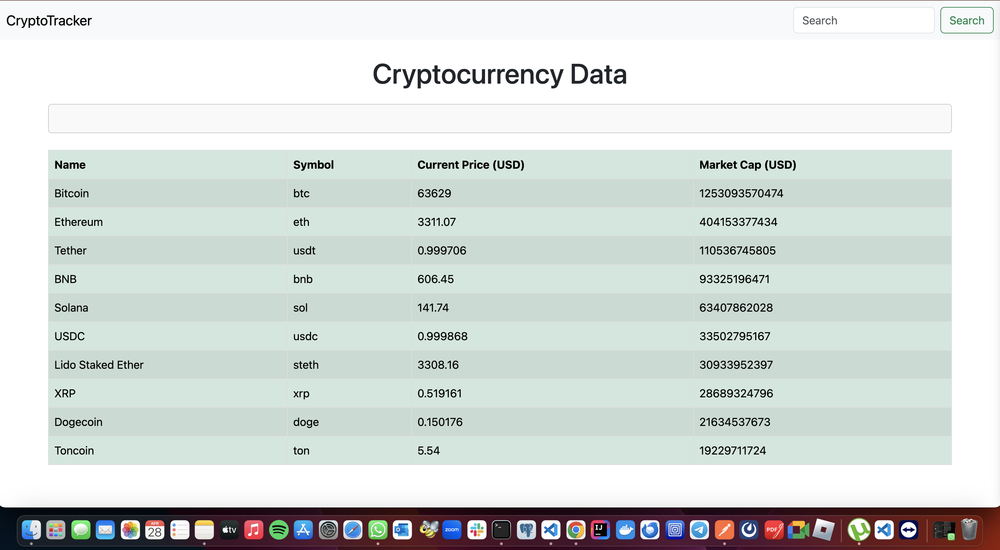

## Sneak Peek



# Crypto Tracker App

## Description

> The app is a cryptocurrency data dashboard that fetches and displays information about cryptocurrencies from the CoinGecko API. It provides data such as the name, symbol, current price, and market cap of the top cryptocurrencies. Additionally, it retrieves global cryptocurrency market data, including total market cap, 24-hour volume, and Bitcoin dominance. The app is built using webpack and deployed on GitHub Pages for easy access.

## Live Demo Link

[Live Link]()

## Built With


## Get Started

### Run

```
To get a clone of the project, run `git@github.com:odhiambo-ed/moringa-mpesa-cryptotracker-app.git`
```

```
cd /moringa-mpesa-cryptotracker-app
```

```
npm install
```

```
npm start
```


## Author(s)

  <a href="https://github.com/odhiambo-ed" target="blank"></a>   **Edward Odhiambo**

- GitHub: [@whit3d](https://github.com/odhiambo-ed)
- Twitter: [@odhiambo_ed](https://twitter.com/odhiambo_ed)
- LinkedIn: [Edward Odhiambo](https://www.linkedin.com/in/edward-odhiambo/)
- Portfolio: [Edward Odhiambo](https://edwardodhiambo.com/)

## 🤝 Contributing

Contributions, issues, and feature requests are welcome!!!

Feel free to check the [issues page]https://github.com/odhiambo-ed/moringa-mpesa-cryptotracker-app/issues)

## Show your support

Give a ⭐️ if you like this project!

## Acknowledgments

- Hat tip to anyone whose code was used
- Special thanks to [Coin Gecko](https://docs.coingecko.com/reference/introduction) for providing access to their API, enabling us to retrieve valuable information about cryptocurrencies for our application.
## 📝 License

This project is [MIT](https://github.com/white3d/GitHub-User-Content/blob/main/LICENSE) licensed.

